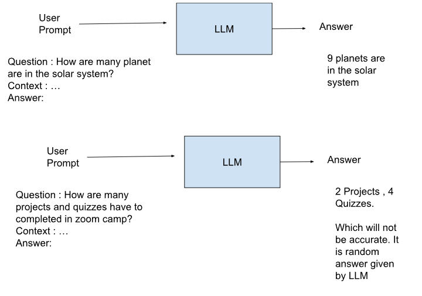
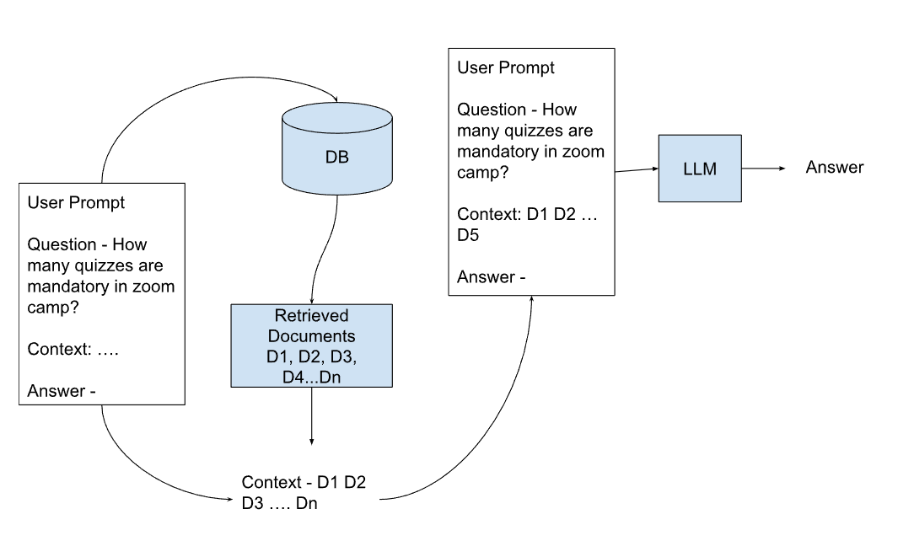

Project

Build a Q & A Bot.

RAG 

Reference

- https://www.youtube.com/watch?v=71MW5WeHdz8 
- https://www.youtube.com/playlist?list=PL3MmuxUbc_hIB4fSqLy_0AfTjVLpgjV3R 
- https://github.com/DataTalksClub/llm-zoomcamp?tab=readme-ov-file
- https://gemini.google.com/app/1ef08e5ee0a63762?hl=en-IN 

Qdrant
http://localhost:6333/dashboard#/collections

This design represents a robust, event-driven MLOps architecture. It separates the "heavy lifting" of data ingestion from the "real-time" responsiveness of the user interface, ensuring scalability and ease of maintenance.

.jpg>)

### 1. The Architectural Core

| Component | Technology | Responsibility |
| :--- | :--- | :--- |
| **Storage** | **AWS S3** | Source of truth for raw `.docx`, processed `.json`, and Q&A logs. |
| **Orchestration** | **Prefect** | Manages the event-based ingestion pipeline and retries. |
| **Vector Database** | **Qdrant** | Handles semantic search using **FastEmbed** (local CPU embeddings). |
| **LLM** | **OpenAI** | Generates human-like answers based on retrieved context. |
| **Frontend UI** | **Dash** | Python-based interactive dashboard for user Q&A. |
| **Compute/Host** | **AWS EC2** | Runs the entire containerized stack via Docker. |
| **Networking** | **Nginx** | Reverse proxy for SSL termination and traffic routing. |

---

### 2. The Two Primary Workflows

#### A. The Ingestion Pipeline (Asynchronous)
1.  **Trigger:** A user uploads a `.docx` file to an S3 "raw" bucket.
2.  **Notification:** S3 sends an event (via Webhook or SQS) to **Prefect**.
3.  **Process:** Prefect triggers a worker to:
    * Parse the Word doc into chunks.
    * Convert chunks into structured **JSON** (with metadata like page numbers).
    * Save JSON back to an S3 "processed" bucket.
4.  **Index:** Qdrant uses **FastEmbed** to generate vectors for these chunks and stores them in a persistent volume.

#### B. The Inference Pipeline (Real-Time)
1.  **Input:** A user enters a question into the **Dash UI**.
2.  **Retrieval:** The app queries **Qdrant** for the top-$k$ most relevant text chunks.
3.  **Augmentation:** The question + retrieved context are sent to the **OpenAI** API.
4.  **Output:** The answer is displayed on the Dash screen.
5.  **Persistence:** The interaction (Q, A, and Timestamp) is pushed to an S3 "logs" folder for future auditing or fine-tuning.

---

### 3. Deployment Strategy

* **Containerization:** Use `docker-compose` to orchestrate three containers: `nginx`, `dash-app`, and `qdrant`.
* **Persistent Storage:** Mount an **EBS volume** to the Qdrant container to ensure vector data survives container restarts.
* **Environment:** Configure your Dash app with `ENV DASH_BASE_PATH=/your-path/` (if deploying behind a specific subpath) and use **IAM Roles** instead of hardcoded AWS keys for S3 access.
* **CI/CD:** **GitHub Actions** automates the build. On every push:
    1.  Run tests.
    2.  Build Docker images.
    3.  Push images to Docker Hub.
    4.  SSH into EC2 to pull and restart the services.

---

### 4. Why this design is "Ready for MLOps"
* **Observability:** Prefect provides a dashboard to monitor document processing failures.
* **Efficiency:** Local embeddings (FastEmbed) reduce costs and external API dependencies.
* **Scalability:** Since Dash and Prefect Workers are decoupled, you can scale the ingestion logic independently of the web traffic.

Are you planning to implement a "Chat History" feature in the Dash UI so users can see their previous questions within the same session?

In providing the design and suggestions, I’ve synthesized technical patterns from current (2025–2026) industry best practices for "Modular RAG" and "Event-Driven DataOps." 

Below are the primary resources and technical guides that validate this specific stack:

### 1. Vector Search & Embedding (Qdrant + FastEmbed)
* **[Qdrant Official: FastEmbed Documentation](https://qdrant.github.io/fastembed/):** This is the primary source for implementing the local embedding logic you mentioned. It explains how to bypass external API latency by using CPU-optimized models directly in your Python container.
* **[Qdrant Workshop: Improving 'R' in RAG](https://github.com/qdrant/workshop-improving-r-in-rag):** A comprehensive 2026 technical guide focusing on hybrid search (combining sparse and dense vectors) and re-ranking—critical for making your "Q&A Book" accurate.

### 2. Orchestration & Event-Driven Logic (Prefect + AWS)
* **[Prefect Blog: Guide to Event-Driven Workflows](https://www.prefect.io/blog/building-real-time-data-pipelines-a-guide-to-event-driven-workflows-in-prefect):** This resource covers the exact "S3-to-Webhook-to-Flow" architecture we discussed. It’s the modern alternative to polling a bucket and is the backbone of the "Zero-Latency" ingestion design.
* **[AWS Architecture Blog: Event-Driven Lens](https://aws.amazon.com/blogs/architecture/):** Standard patterns for S3 Event Notifications and how to bridge them to external compute (like your EC2-hosted Prefect worker).

### 3. Application Framework & UI (Dash)
* **[Plotly Dash Documentation: Long-Running Callbacks](https://dash.plotly.com/long-running-callbacks):** Since RAG (Retrieval + LLM call) can take several seconds, this resource was considered for ensuring your UI doesn’t "freeze" while waiting for OpenAI.
* **[Dash-Mantine-Components](https://www.dash-mantine-components.com/):** The go-to library in 2026 for building the modern, "chat-like" interface for RAG apps using pure Python.

### 4. Production Architecture & MLOps
* **[Red Hat: Planning Production-Grade RAG (2026)](https://www.redhat.com/en/blog/planning-design-your-production-grade-rag-system):** An architectural deep-dive into why RAG systems fail in production and how to mitigate it through better "control logic" (like the Prefect orchestration we included).
* **[DEV Community: Reliable RAG Applications in 2026](https://dev.to/pavanbelagatti/learn-how-to-build-reliable-rag-applications-in-2026-1b7p):** A practical guide that emphasizes storing provenance (metadata) and managing vector DB scaling, which influenced the suggestion to use EBS volumes for your Docker containers.

### 5. Document Processing
* **[Unstructured.io Documentation](https://unstructured-io.github.io/unstructured/):** The leading library for converting messy `.docx` and `.pdf` files into the "LLM-ready" JSON format you mentioned. It handles the structural complexity of Word documents better than basic parsers.

---

**Summary Table of Considered Patterns:**

| Design Choice | Source Pattern | Value |
| :--- | :--- | :--- |
| **Prefect Webhooks** | *Event-Driven DataOps* | Triggers ingestion only when files arrive, saving CPU. |
| **EBS Volume Mounting** | *Stateful Containerization* | Ensures your Qdrant vectors survive an EC2 reboot. |
| **Citations/Metadata** | *Knowledge Retrieval Best Practice* | Essential for a "Book" so users can verify the source page. |
| **FastEmbed** | *Edge/Local Inference* | Massive cost savings vs. using OpenAI's `text-embedding-3`. |

(https://github.com/qdrant/workshop-improving-r-in-rag)

https://gemini.google.com/app/a379e54dfefae38c?hl=en-IN